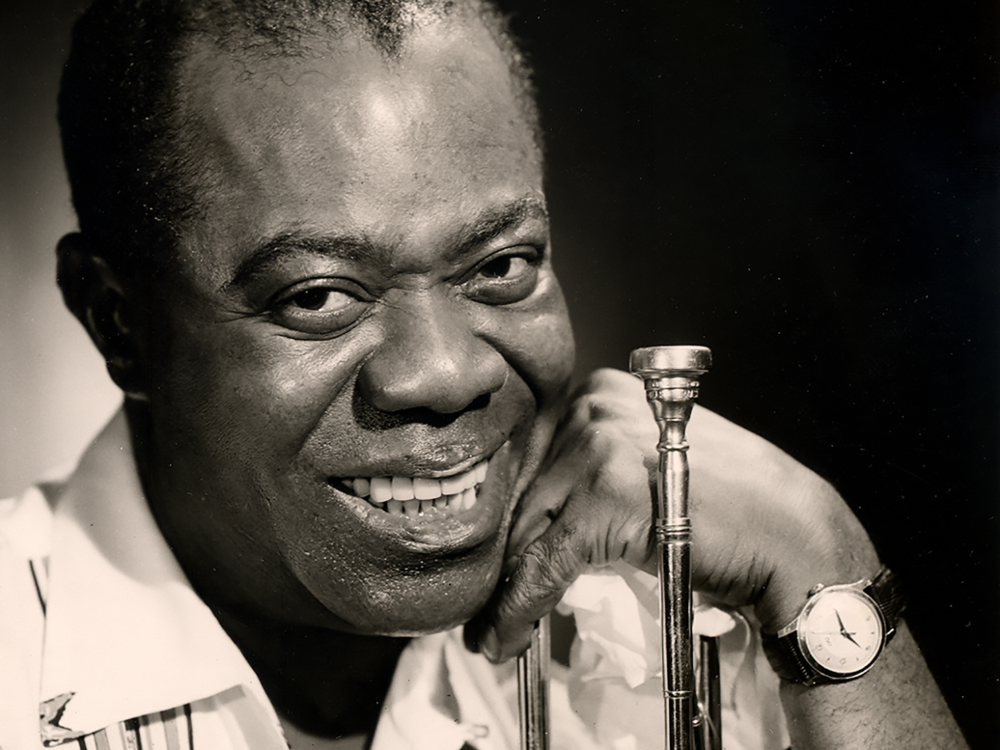

<html lang="en">
<head>
  <meta charset="UTF-8">
  <meta name="viewport" content="width=device-width, initial-scale=1.0">
  <link rel="stylesheet" href="styles.css">
</head>

  <body>
  

    

      

        I see trees of green 
        Red roses too 
        I see them bloom 
        For me and you 
        And I think to myself 
        What a wonderful world 
      

    

    

      

        I see skies of blue 
        And clouds of white 
        The bright blessed day 
        The dark sacred night 
        And I think to myself 
        What a wonderful world 
      

    

    

      

        The colors of the rainbow 
        So pretty in the sky 
        Are also on the faces 
        Of people going by 
      

    

  

  

    

      

        I see friends shaking hands 
        Saying, "How do you do?" 
        They′re really saying 
        "I love you" 
      

    

    

      

        I hear babies cry 
        I watch them grow 
        They'll learn much more 
        Than I′ll ever know 
        And I think to myself 
        What a wonderful world 
      

    

    

      

        Yes, I think to myself 
        What a wonderful world 
        Ooh yeah ... 
      

    

  

</body>

</html>

 
This page is dedicated to Louis Armstrong <a href="https://en.wikipedia.org/wiki/Louis_Armstrong">The Great Satchmo</a>
